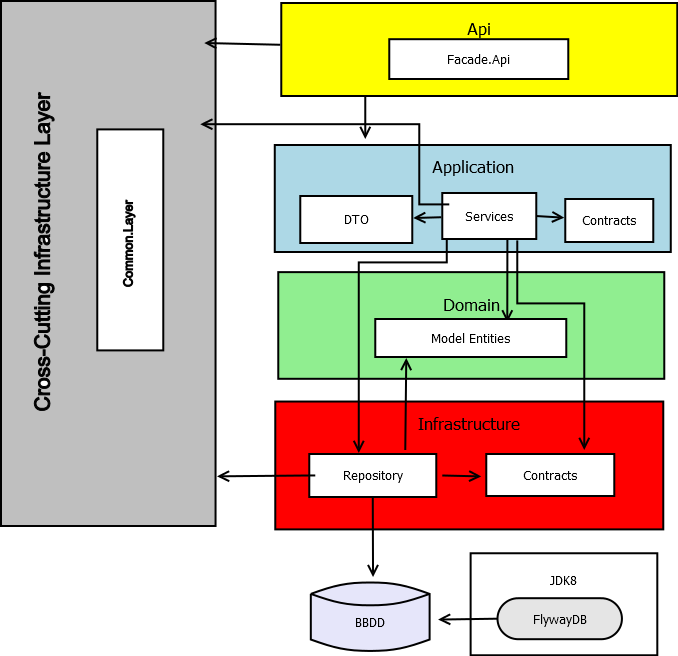

# Project Vueling Web Api

This is a web api project following DDD (Domain Driven Design) architecture. It will also include a log4net logger.

## Diagrama 

## Getting Started

These instructions will get you a copy of the project up and running on your local machine for development and testing purposes. See deployment for notes on how to deploy the project on a live system.

### Prerequisites

What things you need to install the software and how to install them

- Microsoft Visual Studio
- Dia: If you want to open the  original diagram download the program here: http://dia-installer.de/
- Postman to try the web api, download it from here: https://www.getpostman.com/
- Flyway: You can either download Flyway from their website https://flywaydb.org/ or through the package manager chocolatey (first install chocolatey from https://chocolatey.org/, then download flyway from cmd).
If you have never used Flyway, you can check the following beginner tutorial here: https://docs.google.com/presentation/d/19xmgt3PkbqVh6PW8AtLx7IY36bEhnFS1RqaK5ebGB80/edit

### Setup

- Create a new empty database in SQL Server named Covaldo
- Run flyway cmd with "flyway migrate"
- Open Visual Studio and install all packages and framework needed
- Then press Ctrl + F5 to startup the web api
- You can post, update and delete with Postman

### Installing

#### Nuget packages:
- On Vueling.Facade.Api.Tests: EntityFramework and EntityFramework.SqlServerCompact
- On Vueling.Application.Services: Automapper, log4net
- On Vueling.Infrastructure.Repository: log4net, EntityFramework
- On Vueling.Utils.LogHelper: log4net

## Running the tests

To run the test go to Tests -> Run all tests

## Testing with Postman

Or 

## Deployment

To start the application press Ctr + F5

## Built With

- Windows 10
- Visual Studio Enterprise
- SQL Server Manager

## Versioning

We use [Flyway](https://flywaydb.org/) for the database versioning. 
For the project's versions available, see (https://github.com/Fantasmy/DDDWebApi). 

## SOLID Principles

 An example of Single responsability is the LogHelper, which can be called from anywhere.

## Logs
There will be only one log file so it will be easier to follow the stacktrace in case there is an error or exception.

## Authors

* **Jennifer Yep** 

